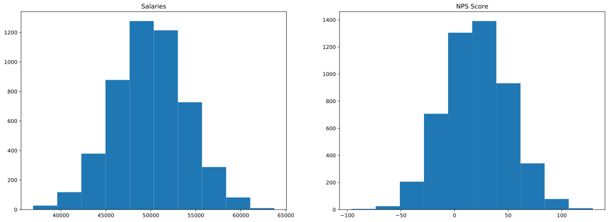
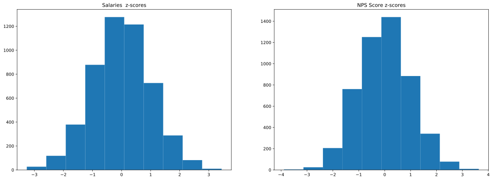
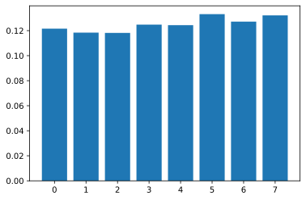
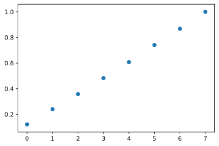
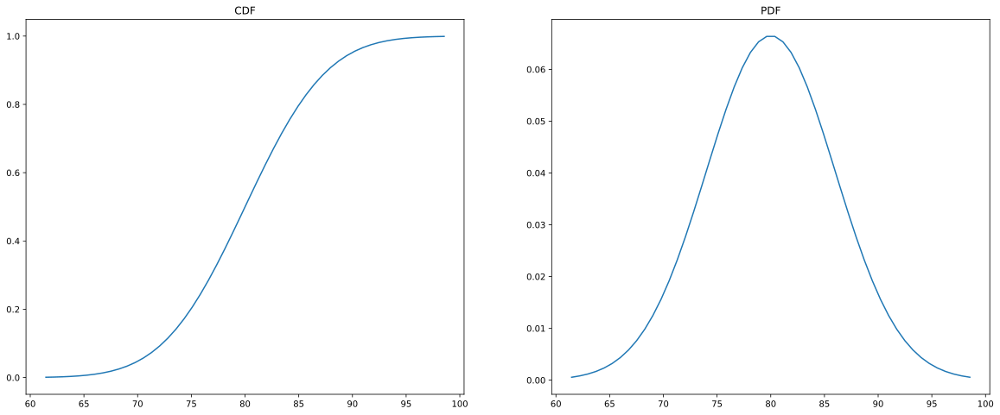

# Objectives
YW
* scrape a website for relevant information, store that information to a dataframe and save that dataframe as a csv file
* load in a dataframe and do the following
    * calculate the zscores of a given column
    * calculate the zscores of a point from a given column in the dataframe
    * calculate and plot the pmf and cdf of another column

# Part 1 - Webscraping
* use the following url scrape the first page of results
* for each item get the name of the item
* store the names to a dataframe and save that dataframe to csv then display
    * store the dataframe in the `data` folder in the repo
    * name the file `part1.csv` and make sure that when you write it you set `index=False`
* the head of the dataframe

* it should match the following


```python
url = "https://www.petsmart.com/dog/treats/dental-treats/#page_name=flyout&category=dog&cta=dentaltreat"
```


```python
# scrape the names of the items on the webpage above
import bs4 as bs
import urllib.request
from lxml import html
import pandas as pd


source = urllib.request.urlopen('https://www.petsmart.com/dog/treats/dental-treats/#page_name=flyout&category=dog&cta=dentaltreat').read()
soup = bs.BeautifulSoup(source,'lxml')

product_names = []
for i in soup.find_all('div', class_='product-name'):
    product_names.append(list(i.next.next.contents))
product_names[0:10]

prod_names_cleaned = []
for name in product_names:
    if len(name) > 1:
        name = (name[0] + name[2])
        prod_names_cleaned.append(str(name))
    prod_names_cleaned.append(str(name).strip('[').strip(']').strip("'"))

```


```python
# load the data into a dataframe file
prod_names_df = pd.DataFrame(prod_names_cleaned)
```


```python
# save the data as a csv file
prod_names_df.to_csv('Product_Names.csv')
```


```python
# display df.head()
prod_names_df.head(10)
```


<div>
<style scoped>
    .dataframe tbody tr th:only-of-type {
        vertical-align: middle;
    }

    .dataframe tbody tr th {
        vertical-align: top;
    }

    .dataframe thead th {
        text-align: right;
    }
</style>
<table border="1" class="dataframe">
  <thead>
    <tr style="text-align: right;">
      <th></th>
      <th>0</th>
    </tr>
  </thead>
  <tbody>
    <tr>
      <th>0</th>
      <td>Greenies Regular Dental Dog Treats</td>
    </tr>
    <tr>
      <th>1</th>
      <td>Greenies Teenie Dental Dog Treats</td>
    </tr>
    <tr>
      <th>2</th>
      <td>Greenies Large Dental Dog Treats</td>
    </tr>
    <tr>
      <th>3</th>
      <td>Greenies Petite Dental Dog Treats</td>
    </tr>
    <tr>
      <th>4</th>
      <td>Authority Dental &amp; DHA Stick Puppy Treats Pars...</td>
    </tr>
    <tr>
      <th>5</th>
      <td>Authority Dental &amp; DHA Stick Puppy Treats Pars...</td>
    </tr>
    <tr>
      <th>6</th>
      <td>WHIMZEES Brushzees Dental Dog Treat - Natural,...</td>
    </tr>
    <tr>
      <th>7</th>
      <td>Pedigree Dentastix Triple Action Dental Dog Tr...</td>
    </tr>
    <tr>
      <th>8</th>
      <td>Pedigree Dentastix Large Dog Treats</td>
    </tr>
    <tr>
      <th>9</th>
      <td>Pedigree Dentastix Large Dog Sticks</td>
    </tr>
  </tbody>
</table>
</div>


# Part 2

load in the csv file located in the `data` folder called `part2.csv`

create a function that calculates the zscores of an array

then calculate the zscores for each column in part2.csv and add them as columns

See below for final result


```python
# load in the dataframe, notice it only contains columns salaries, NPS Score, eventOutcome
df = pd.read_csv('part2.csv') # i moved into the main folder because for some reason it wasn't finding it in the other folder
df.info()
```

    <class 'pandas.core.frame.DataFrame'>
    RangeIndex: 5000 entries, 0 to 4999
    Data columns (total 3 columns):
     #   Column        Non-Null Count  Dtype  
    ---  ------        --------------  -----  
     0   salaries      5000 non-null   float64
     1   NPS Score     5000 non-null   float64
     2   eventOutcome  5000 non-null   int64  
    dtypes: float64(2), int64(1)
    memory usage: 117.3 KB
    


```python
def zscores(arr):
    mean = arr.mean()
    std = arr.std()
    zscores = [(x - mean) / std for x in arr]
    return zscores
    """
    write a function that calculates 
    the zscores of a numpy arr, arr.
    """
```


```python
# calculate the zscore for each column and store them as a new column with the names used 
df['salaries_zscores'] = zscores(df['salaries'])
df['NPS Score_zscores'] = zscores(df['NPS Score'])
df['eventOutcome_zscores'] = zscores(df['eventOutcome'])

df.head()
```


<div>
<style scoped>
    .dataframe tbody tr th:only-of-type {
        vertical-align: middle;
    }

    .dataframe tbody tr th {
        vertical-align: top;
    }

    .dataframe thead th {
        text-align: right;
    }
</style>
<table border="1" class="dataframe">
  <thead>
    <tr style="text-align: right;">
      <th></th>
      <th>salaries</th>
      <th>NPS Score</th>
      <th>eventOutcome</th>
      <th>salaries_zscores</th>
      <th>NPS Score_zscores</th>
      <th>eventOutcome_zscores</th>
    </tr>
  </thead>
  <tbody>
    <tr>
      <th>0</th>
      <td>44112.0</td>
      <td>-7.0</td>
      <td>1</td>
      <td>-1.460155</td>
      <td>-0.913522</td>
      <td>-1.103166</td>
    </tr>
    <tr>
      <th>1</th>
      <td>46777.0</td>
      <td>-12.0</td>
      <td>2</td>
      <td>-0.793981</td>
      <td>-1.080668</td>
      <td>-0.668095</td>
    </tr>
    <tr>
      <th>2</th>
      <td>50013.0</td>
      <td>50.0</td>
      <td>5</td>
      <td>0.014926</td>
      <td>0.991947</td>
      <td>0.637118</td>
    </tr>
    <tr>
      <th>3</th>
      <td>48983.0</td>
      <td>-13.0</td>
      <td>0</td>
      <td>-0.242545</td>
      <td>-1.114097</td>
      <td>-1.538237</td>
    </tr>
    <tr>
      <th>4</th>
      <td>50751.0</td>
      <td>-11.0</td>
      <td>6</td>
      <td>0.199405</td>
      <td>-1.047239</td>
      <td>1.072189</td>
    </tr>
  </tbody>
</table>
</div>


# Part 3 
plot 'salaries' and 'NPS Score' on a subplot (1 row 2 columns) 
then repeat this for the zscores

see image below for reference


```python
# plot for raw salaries and NPS Score data goes here
import matplotlib.pyplot as plt

fig, (ax1, ax2) = plt.subplots(1, 2, figsize=(20, 7))
ax1.hist(df['salaries'])
ax2.hist(df['NPS Score'])
ax1.set_title('Salaries')
ax2.set_title('NPS Score')
```


    Text(0.5, 1.0, 'NPS Score')





```python
# plot for zscores for salaries and NPS Score data goes here
fig, (ax1, ax2) = plt.subplots(1, 2, figsize=(20, 7))
ax1.hist(df['salaries_zscores'])
ax2.hist(df['NPS Score_zscores'])
ax1.set_title('Salaries  z-scores')
ax2.set_title('NPS Score z-scores')
```


    Text(0.5, 1.0, 'NPS Score z-scores')





# Part 4 - PMF
using the column 'eventOutcomes'

create a PMF and plot the PMF as a bar chart

See image below for referenc


```python
outcome_list = [0, 1, 2, 3, 4, 5, 6, 7]
prob_list = []
for i in df['eventOutcome'].unique():
    prob_list.append(len(df['eventOutcome'].loc[df['eventOutcome'] == i]) / len(df))

prob_dict = dict(zip(outcome_list, prob_list))
```


```python
plt.bar(prob_dict.keys(), height=prob_dict.values())
```


    <BarContainer object of 8 artists>





# Part 5 - CDF
plot the CDF of Event Outcomes as a scatter plot using the information above

See image below for reference 


```python
cdf_list = []
cdf = 0
for i in prob_dict.keys():
    cdf += prob_dict[i]
    cdf_list.append(cdf)

cdf_list

plt.scatter(x=prob_dict.keys(), y=cdf_list)
```


    <matplotlib.collections.PathCollection at 0x1e22193cdd8>





# Level Up:
* using np.where find salaries with zscores <= -2.0

* calculate the skewness and kurtosis for the NPS Score column

* plot the pdf and cdf of a given distribution


```python
# find salaries with zscores <= 2.0 
import numpy as np

df['salaries_zscores'].loc[df['salaries_zscores'] <= -2.0]
df['salaries'].iloc[np.where(df['salaries_zscores'] <= -2.0)]
```


    20      39383.0
    41      38063.0
    89      41458.0
    107     40854.0
    285     40886.0
             ...   
    4692    38341.0
    4707    41813.0
    4731    41184.0
    4765    40108.0
    4949    38915.0
    Name: salaries, Length: 123, dtype: float64


```python
# calculate skewness and kurtosis of NPS Score column
import scipy.stats as ss

df['NPS Score'].skew(), df['NPS Score'].kurtosis()
```


    (0.024512631283945336, -0.04096834144076489)


# Plotting a pdf and cdf of a normal distribution
A survey is taken that finds that students send an mean average of 80 DMs a day with a standard deviation of 6 DMS. 


```python
# plot the pdf and cdf of this normal distribution. level up if you can do it in subplots
x = np.linspace(ss.norm.ppf(0.001, 80, 6), ss.norm.ppf(.999, 80, 6))

y_cdf = ss.norm.cdf(x, 80, 6)
y_pdf = ss.norm.pdf(x, 80, 6)

fig, (ax1, ax2) = plt.subplots(1, 2, figsize=(20, 8))
ax1.plot(x, y_cdf)
ax1.set_title('CDF')
ax2.plot(x, y_pdf)
ax2.set_title('PDF')
```


    Text(0.5, 1.0, 'PDF')





```python
# what is the probability of drawing a student that sends at least 82 DMs a day?
ss.norm.cdf(82, 80, 6)
```


    0.6305586598182363


A second survey is taken at another bootcamp that shows that students send a mean average of
80 DMs a day, but they have a standard deviation of 9 DMS.  


```python
# What is the difference in the probability of finding a student that sends, at most, 65 DMs a day? 
ss.norm.cdf(65, 80, 6) - ss.norm.cdf(65, 80, 9)
```


    -0.04158068694703857


# run the cell below to convert your notebook to a README for assessment


```python
!jupyter nbconvert --to markdown assessment.ipynb && mv assessment.md README.md
```
